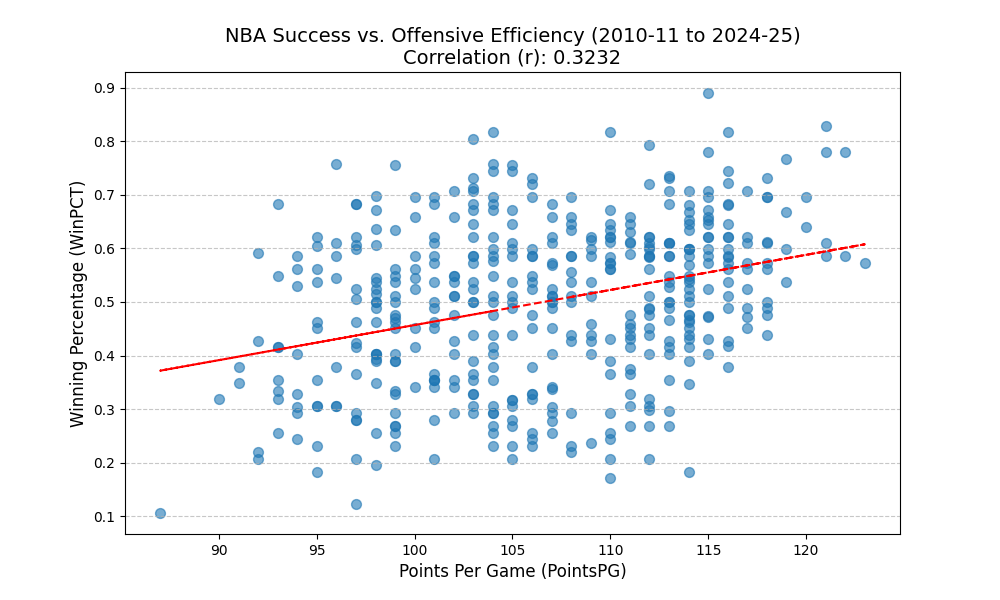
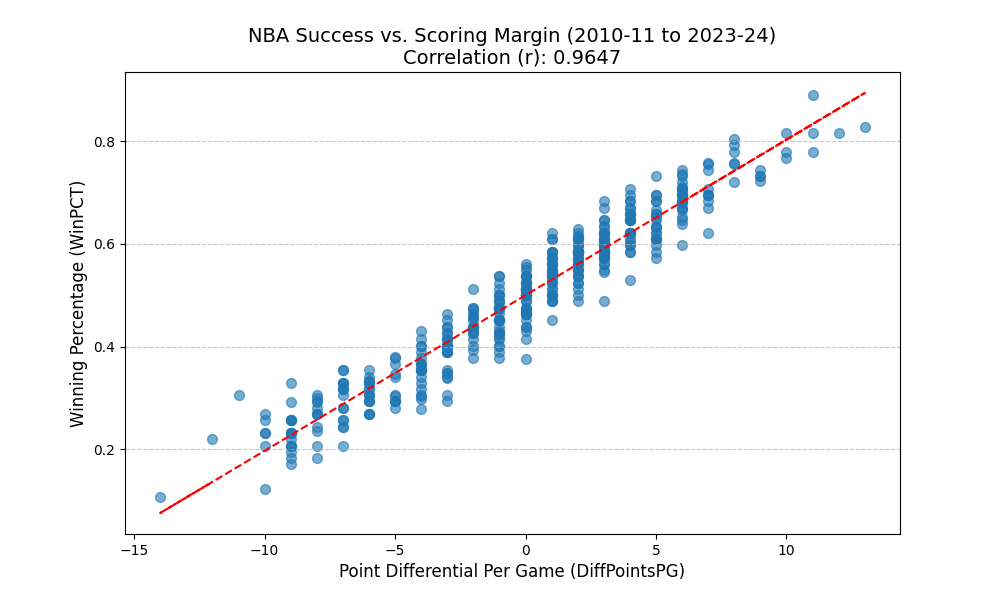

<script src="https://polyfill.io/v3/polyfill.min.js?features=es6"></script>
<script id="MathJax-script" async
  src="https://cdn.jsdelivr.net/npm/mathjax@3/es5/tex-mml-chtml.js">
</script>

# What does NBA data really tell us?

The game of basketball has changed in many ways throughout the years. From the style of play to the athletes themselves, the NBA has evolved into a fast-paced, high-scoring league that emphasizes athleticism and skill. But what does the data tell us about these changes? Is it effective to rely purely on scoring, or does defense really win championships? In this blog post, we will explore some key statistics and trends in the NBA to uncover what the data really tells us about the game.

---

# Motivating Question

What do we want to learn from this data? What I am going to explore is how does points per game impact your winning percentage? Also, if you are leading at the half, does that mean you are winning the games? How consistant of a team are you from the start of the game to the end. 

---

# Data Collection

I got all my data directly from the **NBA API** that is available as a python package. This is an easy and ethical way to gather the data you need for analysis. There are a couple other ways to get the data, like by webscraping, but since the API is available, this is the easiest way. The important package to have installed on your computer is `nba_api`. You will need to run something like `pip3 install nba_api` to get this package. Once you have it installed, you can type `from nba_api.stats.endpoints import LeagueStandings`. This will access the NBA's API on **stats.nba.com**. From there, you can run a python code to get all the data needed from the website.

Here is the code I ran to get the data from this analysis:

```python
import pandas as pd
from nba_api.stats.endpoints import LeagueStandings
import time

START_YEAR = 2010
END_YEAR = 2025

seasons = [f'{i}-{i+1-2000}' for i in range(START_YEAR, END_YEAR)]

all_seasons_df = []

for season in seasons:
    standings = LeagueStandings(season=season, season_type='Regular Season')
    season_df = standings.get_data_frames()[0]
    season_df['SEASON_YEAR_FULL'] = season
    all_seasons_df.append(season_df)
    time.sleep(1) 
        
df_final = pd.concat(all_seasons_df, ignore_index=True)

filename = 'nba_team_standings_historical.csv'
df_final.to_csv(filename, index=False)
```

At this point, the data you have collected will be saved as "nba_team_standings_historical.csv". Now that we have all of the data, we want to select the variables of interest and clean the data. We can run the following code to do so:

```python
import pandas as pd
import numpy as np
import matplotlib.pyplot as plt

file_path = 'nba_team_standings_historical.csv'
df = pd.read_csv(file_path)

CORE_FEATURES = [
    'SEASON_YEAR_FULL',
    'TeamName',
    'WINS', 
    'WinPCT',
    'PointsPG',
    'DiffPointsPG',
    'AheadAtHalf',
    'HOME',
    'ROAD'
]

df_filtered = df[CORE_FEATURES].copy()

df_filtered['WinPCT'] = pd.to_numeric(df_filtered['WinPCT'], errors='coerce')

home_split = df_filtered['HOME'].str.split('-', expand=True)
df_filtered['Home_Wins'] = pd.to_numeric(home_split[0], errors='coerce')
df_filtered['Home_Losses'] = pd.to_numeric(home_split[1], errors='coerce')

road_split = df_filtered['ROAD'].str.split('-', expand=True)
df_filtered['Road_Wins'] = pd.to_numeric(road_split[0], errors='coerce')
df_filtered['Road_Losses'] = pd.to_numeric(road_split[1], errors='coerce')

df_filtered = df_filtered.drop(columns=['HOME', 'ROAD'])

df_filtered.to_csv('nba_clean_for_eda.csv', index=False)
```

# Finding Number 1

The first question I want to answer with the data is does having a higher offensive presence i.e scoring more point, lead to a higher win percentage? The results I found were quite shocking. Use this code, I was able to get a graph and a correlation coefficient:

``` python
new_filename = 'nba_clean_for_eda.csv'
df_final = pd.read_csv(new_filename)

X_VAR = 'PointsPG'
Y_VAR = 'WinPCT'

correlation = df[X_VAR].corr(df[Y_VAR])

plt.figure(figsize=(10, 6))

plt.scatter(df[X_VAR], df[Y_VAR], alpha=0.6, s=50)

plt.title(f'NBA Success vs. Offensive Efficiency (2010-11 to 2023-24)\nCorrelation (r): {correlation:.4f}', fontsize=14)
plt.xlabel('Points Per Game (PointsPG)', fontsize=12)
plt.ylabel('Winning Percentage (WinPCT)', fontsize=12)
plt.grid(axis='y', linestyle='--', alpha=0.7)

z = np.polyfit(df[X_VAR], df[Y_VAR], 1)
p = np.poly1d(z)
plt.plot(df[X_VAR], p(df[X_VAR]), "r--", label=f'Trend Line')

plot_filename = 'eda_points_vs_winpct.png'
plt.savefig(plot_filename)
plt.close()
```


From the chart, we can see that the correlation coefficient between team success and offenseive efficiency is only .3232, which is not strong. While having a high powered offense does help you win games, it doesn't make that you win every game. There are other factors that play into winning a game. Perhaps defense really does win championships. I wanted to dive a little deeper into this stat. I decided to look at point differential vs winning percentage instead of just pure scoring. When I looked at that result, something more predictable happened:

``` python
import pandas as pd
import numpy as np
import matplotlib.pyplot as plt

file_path = 'nba_clean_for_eda.csv'
df = pd.read_csv(file_path)

X_VAR_DIFF = 'DiffPointsPG'
Y_VAR = 'WinPCT'

correlation_diff = df[X_VAR_DIFF].corr(df[Y_VAR])

print(f"--- Correlation Analysis for {X_VAR_DIFF} vs. {Y_VAR} ---")
print(f"The Pearson correlation coefficient (r) is: {correlation_diff:.4f}")

plt.figure(figsize=(10, 6))

plt.scatter(df[X_VAR_DIFF], df[Y_VAR], alpha=0.6, s=50)

plt.title(f'NBA Success vs. Scoring Margin (2010-11 to 2023-24)\nCorrelation (r): {correlation_diff:.4f}', fontsize=14)
plt.xlabel('Point Differential Per Game (DiffPointsPG)', fontsize=12)
plt.ylabel('Winning Percentage (WinPCT)', fontsize=12)
plt.grid(axis='y', linestyle='--', alpha=0.7)

z = np.polyfit(df[X_VAR_DIFF], df[Y_VAR], 1)
p = np.poly1d(z)
plt.plot(df[X_VAR_DIFF], p(df[X_VAR_DIFF]), "r--", label=f'Trend Line')

plot_filename = 'eda_diffpoints_vs_winpct.png'
plt.savefig(plot_filename)
plt.close()

print(f"\nScatter plot saved as: {plot_filename}")
```
